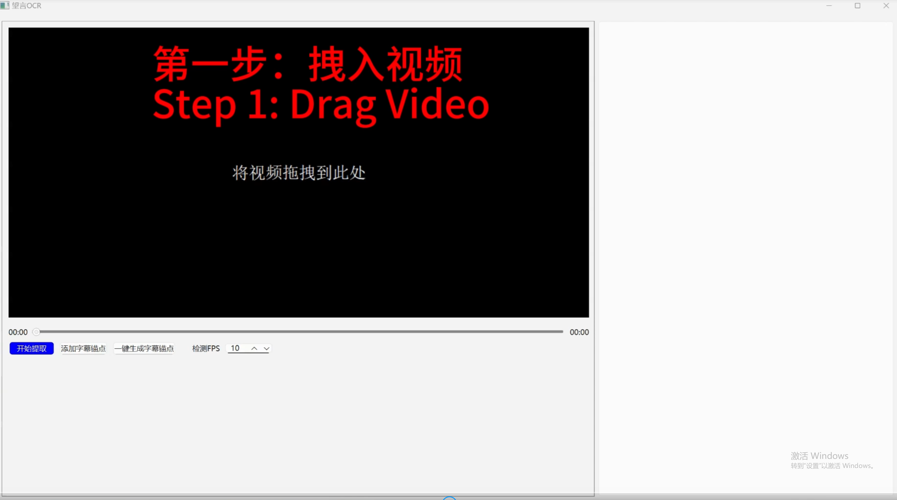

English | [简体中文](README.md)

# SubtitleOCR

Extracting hardcode subtitles in videos using Optical Character Recognition(OCR), and converting them to independent '.srt' files.


## Video Tutorial
The video is too large. Please go to [BiliBili](https://www.bilibili.com/video/BV1dJ2rYPEKP/) to watch it.



## Install & Run
Get source code：
```
git clone https://github.com/nhjydywd/SubtitleOCR
cd SubtitleOCR
```

Install dependencies：
```
pip install -r requirements.txt
```

Download models (can be skipped next time)
```
python ./download_models.py
```
If the download failed, you need to go to [the official site of PaddleOCR](https://paddlepaddle.github.io/PaddleOCR/main/ppocr/model_list.html) to manually download models.

After downloading, the `models` directory should be like:


Finally, launch the GUI:
```
python ./launch_gui.py --lang en
```


## Thanks
PaddleOCR：[https://github.com/PaddlePaddle/PaddleOCR](https://github.com/PaddlePaddle/PaddleOCR)