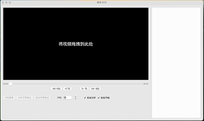

<!-- 简体中文 | [English](README.en.md) -->

# 望言OCR

望言OCR是一款全新的硬字幕提取工具，旨在加速AI时代下的视频硬字幕数据挖掘工作。

  

⚡️快如闪电，仅需Apple m1芯片即可达到x9的提取速度（即9倍速提取）。

🛠️智能分析，无需人工干预，自动分析并完成识别。

🌐多语字幕支持，覆盖中文、英文、日文、韩文。

🎯精准提取，有效排除画面中的水印等干扰文字，确保字幕的纯净。

## 性能
以往的硬字幕提取工具的速度很难称得上令人满意，因此开发望言OCR的核心出发点是优化硬字幕提取的速度。通过将硬字幕提取拆分成”解码“、”检测“、”识别“三个充分并行的阶段，并采用NPU提高运算效率，望言OCR实现了提取速度的大幅提升。

下面是一个性能测试的结果，测试视频为一段45分钟的中英双语视频，对比的对象是另外两个同类工具，分别在M1、M2和M3芯片的Mac平台上进行测试：（x后面的数字表示能达到几倍速）

| 测试平台 | [某开源工具](https://github.com/YaoFANGUK/video-subtitle-extractor) | [某闭源工具](https://apps.apple.com/cn/app/%E9%9B%A8%E4%BC%9E%E8%A7%86%E9%A2%91%E5%AD%97%E5%B9%95%E6%8F%90%E5%8F%96-%E9%9F%B3%E9%A2%91-%E5%BD%95%E9%9F%B3-%E8%A7%86%E9%A2%91%E8%BD%AC%E6%96%87%E5%AD%97%E7%A1%AC%E5%AD%97%E5%B9%95%E6%8F%90%E5%8F%96/id1639976304?mt=12) | **望言OCR** |
| :------: | :------: | :------:  | :------: |
| M1 Macbook Air | x1.6 | x2.4  | **x9.0** |
| M2 Macbook Air | x1.8 | x2.9  | **x10.5** |
| M3 Macbook Pro | x2.1 | x3.5  | **x12.1** |

## 下载使用

**Mac用户**：[点此处下载mac版APP](https://github.com/nhjydywd/SubtitleOCR/releases/tag/v1.1#:~:text=subocr_macos_v1.1.zip)

打开APP后，拖入要提取硬字幕的视频，等待提取完毕即可导出。

  

**Windows用户**：Windows版APP尚未开发完成，可使用开源Python版，[点此处查看参考步骤](README.python.md)。

*本应用采用部分开源，即Python版开源，而APP版（包括Mac APP和未来的Window APP）暂不开源。*
*APP版采用C++作为主要语言进行开发，确保为您带来极致的性能。APP商用收益将用于支持进一步开发与维护。*

## 鸣谢
PaddleOCR：[https://github.com/PaddlePaddle/PaddleOCR](https://github.com/PaddlePaddle/PaddleOCR)
