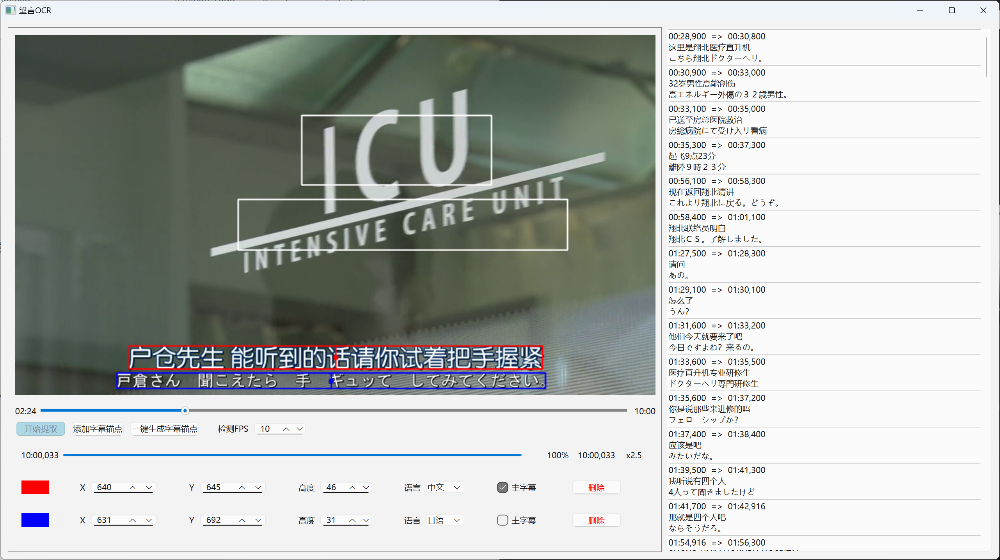
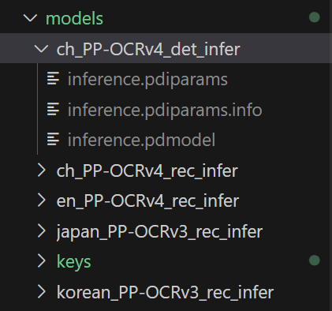

简体中文 | [English](README.en.md)


# 望言OCR

基于光学字符识别（OCR）技术将视频中嵌入的硬字幕提取为独立的SRT文件。


## 视频演示
If the video cannot be loaded, please go to [Bilibili](https://www.bilibili.com/video/BV1dJ2rYPEKP/) to watch it.

<video controls style="max-height: 300px;">
  <source src="docs/tutorial.mp4" type="video/mp4" >
  Your browser does not support the video tag.
</video>

## 安装 & 运行
获取源码：
```
git clone https://github.com/nhjydywd/SubtitleOCR
cd SubtitleOCR
```
安装依赖项：
```
pip install -r requirements.txt
```

下载模型（后续启动可以跳过这一步）
```
python ./download_models.py
```
如果下载不成功，则需要您手动前往[PaddleOCR官网](https://paddlepaddle.github.io/PaddleOCR/main/ppocr/model_list.html)下载模型

正常完成这一步后，models文件夹应当具有如下结构：




最后，就可以启动GUI了
```
python ./launch_gui.py
```

Note: English users can use this command to launch an English GUI：
```
python ./launch_gui.py --lang en
```


## 特点
* 🔄 多语字幕：支持为每个字幕指定单独的语言。
* 🚀 GPU加速：充分利用显卡的算力。
* 🔍 准确提取：基于字幕锚点（中心点）进行字幕选取，相比传统的基于矩形框选取，显著增强对画面中无关文字的过滤能力。


## 鸣谢
PaddleOCR：[https://github.com/PaddlePaddle/PaddleOCR](https://github.com/PaddlePaddle/PaddleOCR)