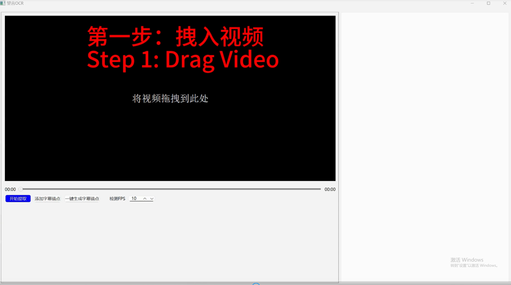

简体中文 | [English](README.en.md)


# 望言OCR

基于光学字符识别（OCR）技术将视频中嵌入的硬字幕提取为独立的SRT文件。


## 视频教程
因视频过大，请前往[哔哩哔哩](https://www.bilibili.com/video/BV1dJ2rYPEKP/)进行观看。




## 安装 & 运行
### 1. 获取源码：
```
git clone https://github.com/nhjydywd/SubtitleOCR
cd SubtitleOCR
```

### 2. 安装依赖项：
```
pip install -r requirements.txt
```
注：如果PaddlePaddle报错，建议您参照[官方文档](https://www.paddlepaddle.org.cn/install/quick?docurl=/documentation/docs/zh/install/pip/windows-pip.html)进行安装

### 3. 下载模型（后续启动可以跳过这一步）
```
python ./download_models.py
```
如果下载不成功，则需要您手动前往[PaddleOCR官网](https://paddlepaddle.github.io/PaddleOCR/main/ppocr/model_list.html)下载模型。正常完成这一步后，models文件夹应当具有如下结构：


### 4. 启动GUI
```
python ./launch_gui.py
```

Note: English users can use this command to launch an English GUI：
```
python ./launch_gui.py --lang en
```


## 鸣谢
PaddleOCR：[https://github.com/PaddlePaddle/PaddleOCR](https://github.com/PaddlePaddle/PaddleOCR)