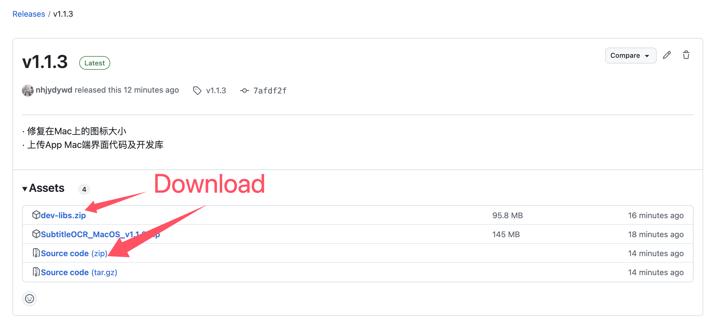
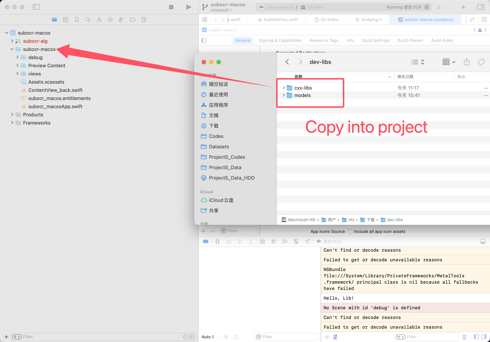
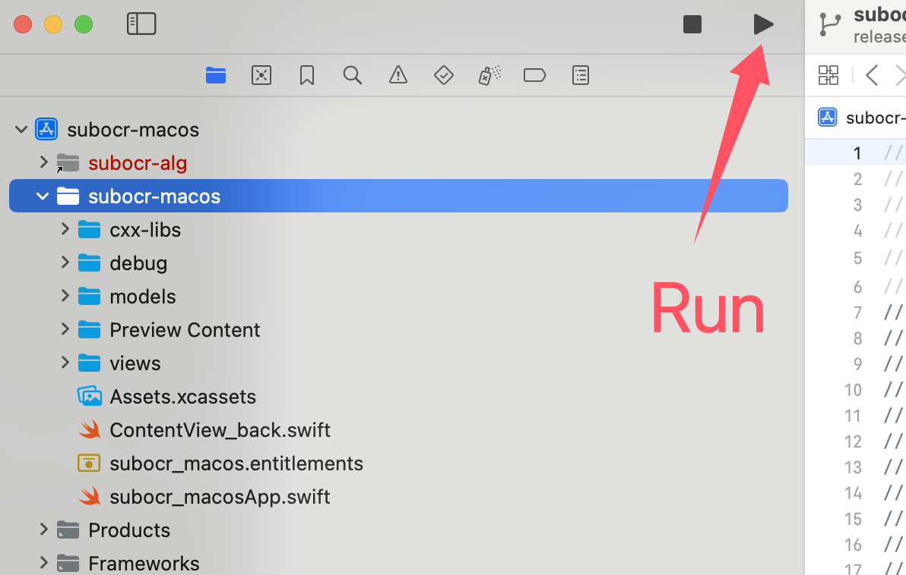
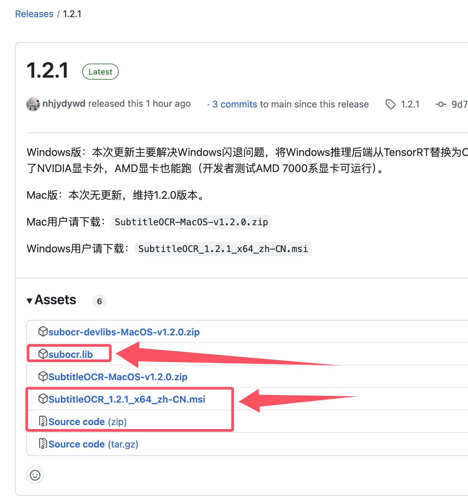
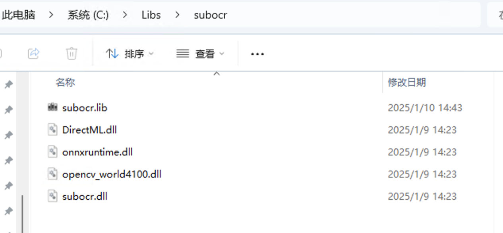
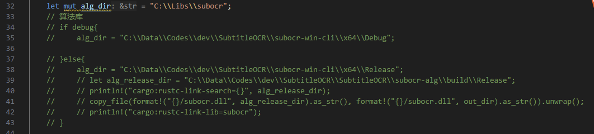
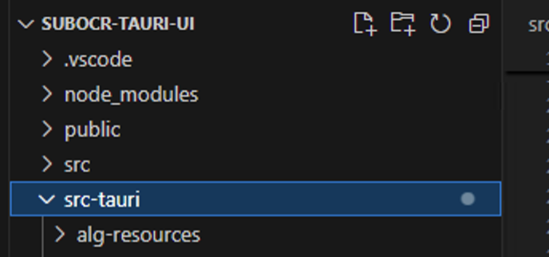
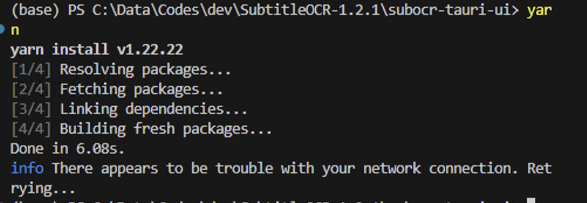
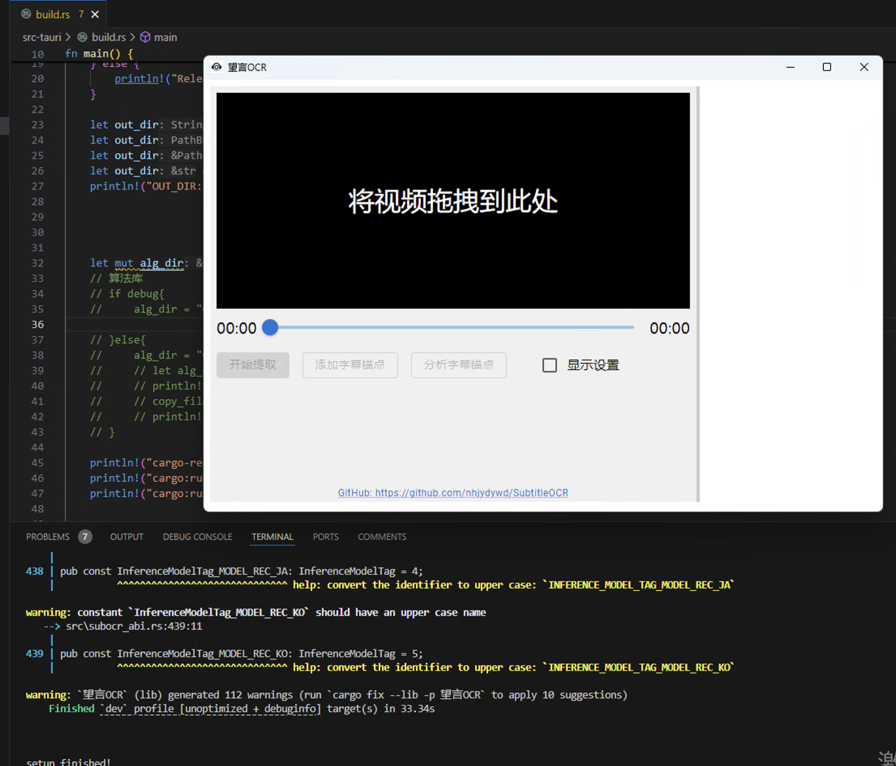

# 修改与定制
望言OCR的GUI代码已开源，而算法库以二进制库+C接口的形式提供。本页面描述如何运行该项目。

## MacOS平台
MacOS版使用SwiftUI构建。如果您对Swift和SwiftUI不熟悉，可以查看[苹果官方文档](https://developer.apple.com/xcode/swiftui/)，或查看[Hacking with Swift系列教程](https://www.hackingwithswift.com/100/swiftui)。

1. 首先在Release页面下载源码和开发库(dev-libs.zip)。

2. 进入源码目录下的subocr-swiftui文件夹，双击打开subocr-macos.xcodeproj。

3. 解压dev-libs.zip，将cxx-libs和models复制进项目目录下的subocr-macos文件夹

4. 编译运行项目

## Windows平台
Windows平台使用[Tauri](https://github.com/tauri-apps/tauri)+[React](https://github.com/facebook/react)+[Typescript](https://github.com/microsoft/TypeScript)进行构建，在进行开发前您需要具有少量Rust和React-TS知识，并需要您具有`node` & `yarn`环境。

1. 首先在Release页面下载APP、源码及`subocr.lib`。注意一定要在同一个Release页面下载这些文件，因为不同版本接口有可能不同。

2. 安装下载的APP，然后将APP安装目录下的几个dll全部复制到某个文件夹（由你决定），并将刚才下载的`subocr.lib`也复制到该文件夹。
本示例中创建了`C:\Libs\subocr`文件夹用于存放这几个文件。

3. 用VSCode打开源码文件夹下的`subocr-tauri-ui`文件夹，修改文件夹中的`src-tauri/build.rs`脚本，将`alg-dir`变量修改为刚才存放库的文件夹，在这个例子中是`C:\Libs\subocr`。

4. 将APP安装目录下的`alg-resources`文件夹复制到`subocr-tauri-ui`文件夹下的`src-tauri`文件夹。

5. 打开VSCode控制台，执行`yarn`

6. 接着执行`yarn tauri dev`，即可启动和调试APP。

